# Azure Cloud Fundamentals and Data Pipeline Implementation using ADF

**Objective:**
To understand Azure cloud concepts and build a complete data pipeline using Storage Account and Azure Data Factory.

---

## Assignment Tasks

### Task 1: Explore Azure Portal
* Create a Resource Group

**Deliverable:**
Screenshot of Resource Group

**Screenshot:**
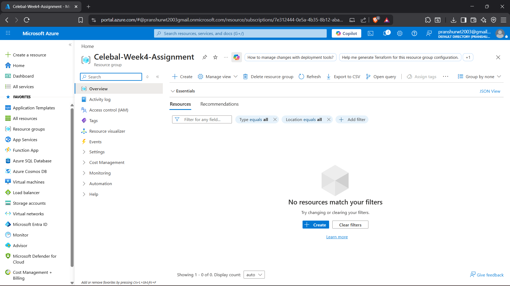

---

### Task 2: Storage Setup
**Do:**
* Create a Storage Account
* Create a Blob Container
* Upload a CSV file

**Deliverable:**
Screenshot of container with uploaded file

**Screenshot:**
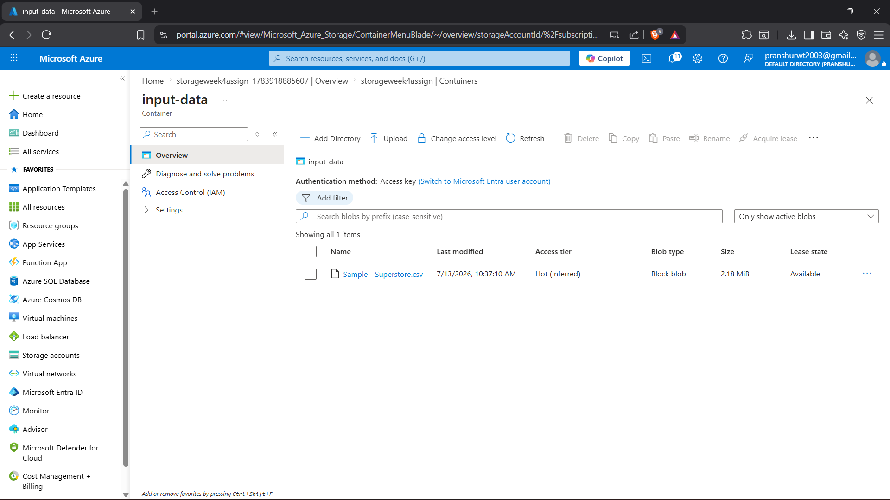

---

### Task 3: ADF Basics
**Do:**
* Create Azure Data Factory
* Explore ADF UI (Author, Monitor, Manage)
* Create Linked Service (Blob Storage)
* Create datasets (source + destination)
* Use Get Metadata activity

**Deliverable:**
* Screenshot of Linked Service
* Screenshot of dataset
* Screenshot of Get Metadata activity

**Screenshot: Linked Service**
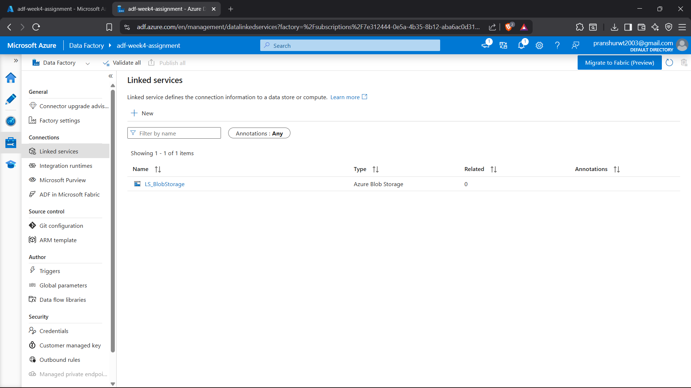

**Screenshot: Dataset**
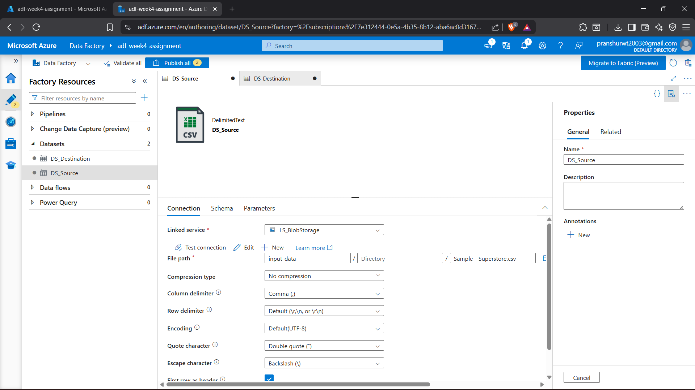

**Screenshot: Get Metadata activity**
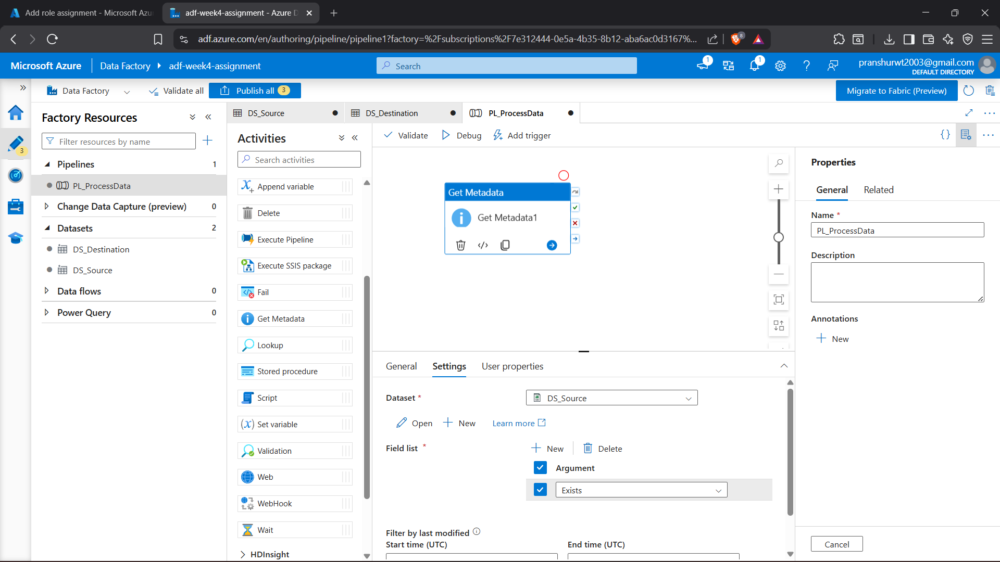

---

### Task 4: Pipeline Development
**Do:**
* Create pipeline using Copy Data activity
* Configure source and destination
* Add ForEach activity (optional if multiple files)

**Deliverable:**
Screenshot of pipeline design

**Screenshot: Pipeline Design**
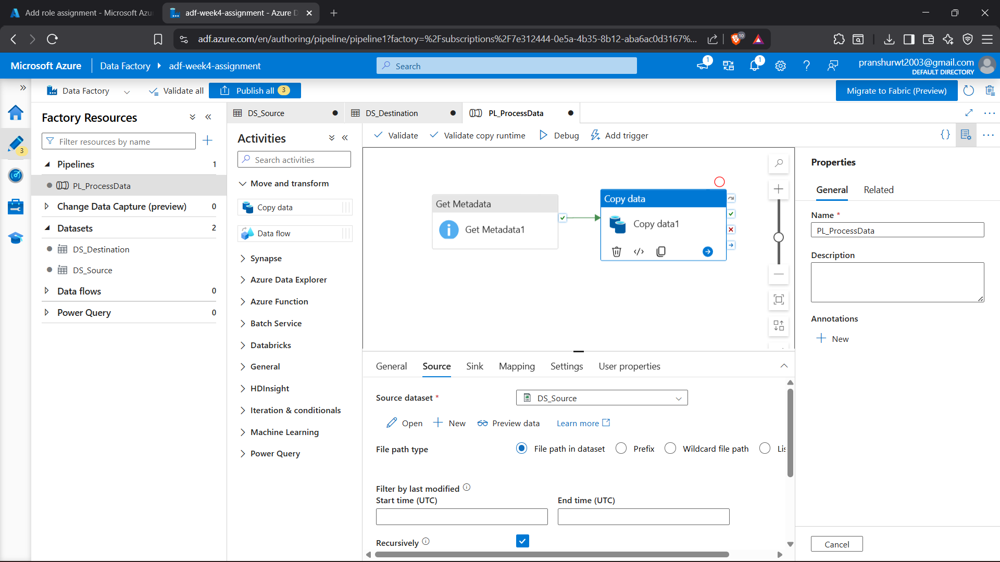
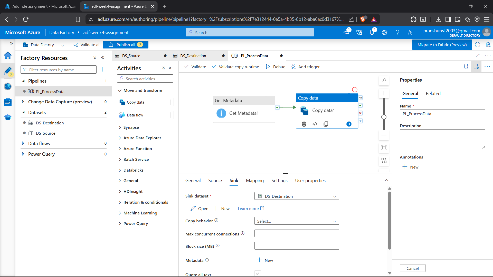

---

### Task 5: Pipeline Execution
**Do:**
* Run pipeline using Debug/Trigger 
* **Deliverable:** Screenshot showing pipeline execution (Succeeded)

**Screenshot: Pipeline Execution (Succeeded)**
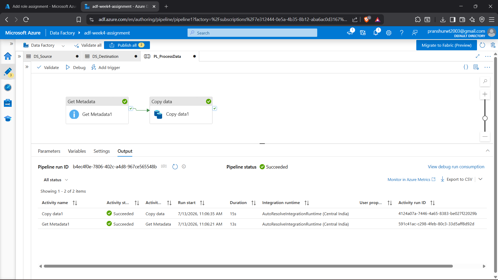

---

### Task 6: IAM Roles
**Do:**
* Assign roles: 
  * Reader 
  * Contributor
* Provide access to ADF for Storage

**Deliverable:**
Screenshot of role assignment

**Screenshot: Role Assignment**
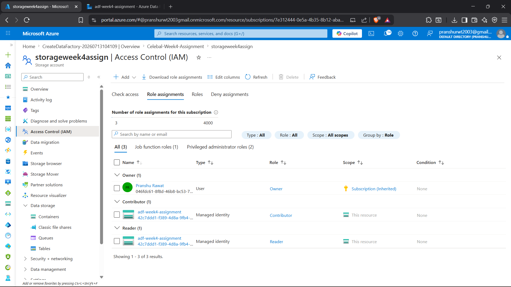

---

## Mini Project (Final Task)

**Problem Statement:**
Build a complete pipeline that reads a CSV file from Blob Storage and processes it using Azure Data Factory.

**Requirements:**
* Source: CSV file in Blob
* Use: Linked Service + Dataset + Pipeline
* Process: Copy Data + Metadata check
* Destination: New file/location

**Expected Output:**
* Pipeline executed successfully
* Data copied to destination
* Metadata validated

**Screenshot: Pipeline Executed Successfully**
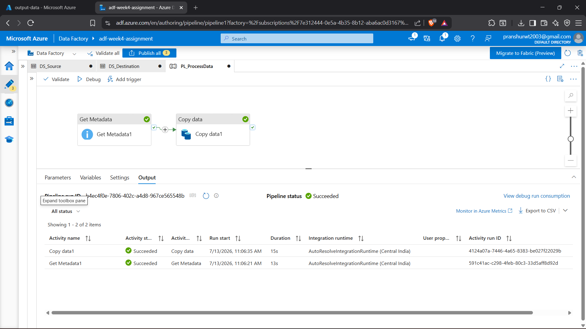

**Screenshot: Data copied to destination**
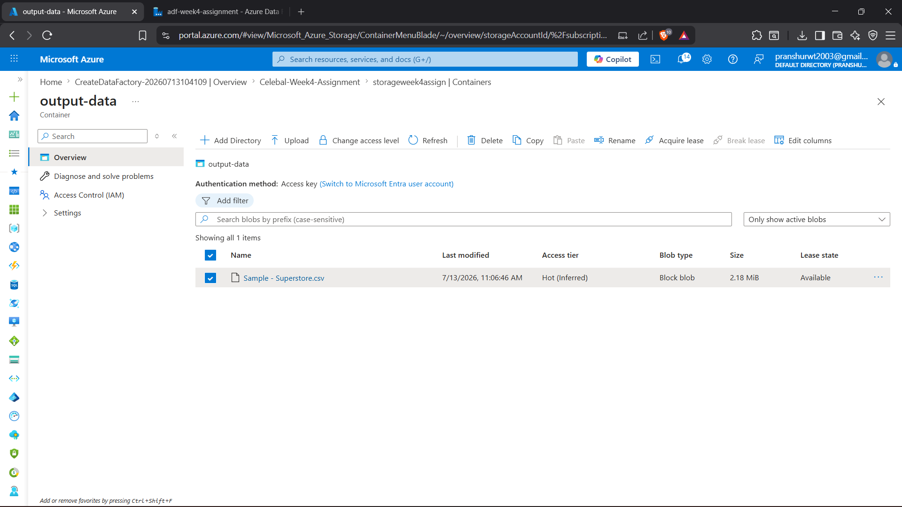

**Screenshot: Metadata Validated**
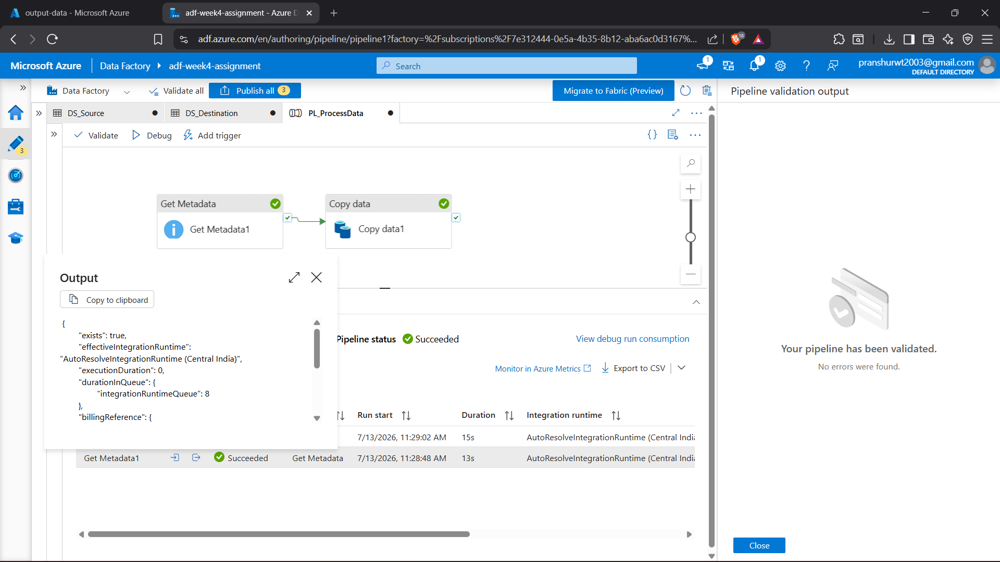
